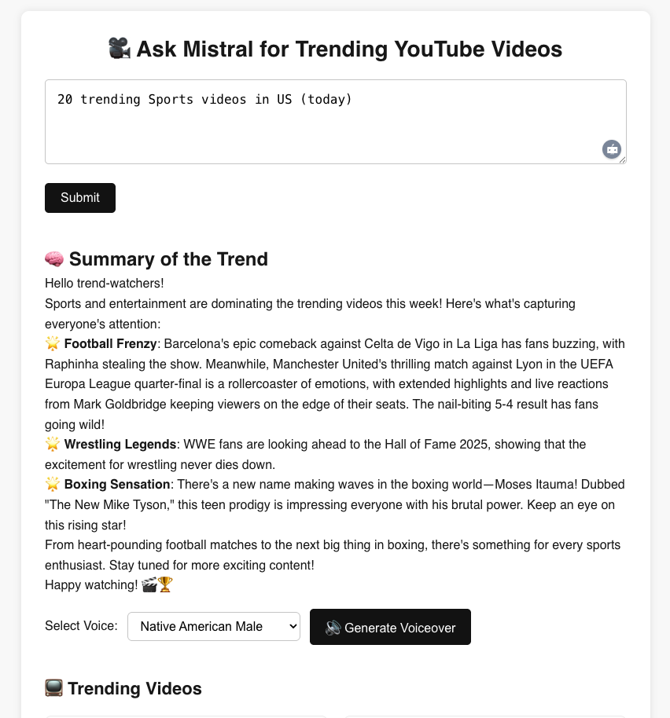

# 📺 YouTube Trend Assistant

An AI-powered full-stack app that lets users ask natural-language questions like  
“**Show me 20 trending gaming videos this week in the US**” and get instant YouTube trends, summaries, and realistic voiceovers.

Built with **Next.js**, **Mistral AI**, **MongoDB Atlas**, **ElevenLabs**, and **YouTube Data API**.

---

## 🚀 Features

- 🎯 Query trending YouTube videos by timeframe, region, category, and count
- 🔍 Mistral AI interprets your query and summarizes top video trends
- 🎤 ElevenLabs voiceover with realistic voices (African American, Native American, etc.)
- 🎞 Clickable video thumbnails to watch directly on YouTube
- 🧠 React + Markdown rendering for clean summaries
- 💾 Query history stored in **MongoDB Atlas**
- ⏯ Audio playback with full controls
- 🧭 Pagination for user query history

---

## 🖥 Tech Stack

| Frontend | Backend | AI & Data | Storage |
|----------|---------|-----------|---------|
| Next.js  | API Routes | Mistral AI (chat + summary) | MongoDB Atlas |
| React    | ElevenLabs TTS | YouTube Data API v3 | localStorage + cloud |

---

## 📦 Quick Setup

### 1. Clone the repo

```bash
git clone https://github.com/your-username/youtube-trend-assistant.git
cd youtube-trend-assistant
```

### 2. Install dependencies

```bash
npm install
```

### 3. Set up `.env.local`

Create a file called `.env.local` in the root:

```env
YOUTUBE_API_KEY=your_youtube_api_key
MISTRAL_API_KEY=your_mistral_api_key
ELEVENLABS_API_KEY=your_elevenlabs_api_key
MONGO_URI=your_mongodb_connection_uri
```

### 4. Run the development server

```bash
npm run dev
```

Open [http://localhost:3000](http://localhost:3000) to view the app.

---

## 📷 Screenshots

### 🎤 AI Voice & Summary



### 📺 Trending Video Cards


---

## 📂 Project Structure

```
youtube-trend-assistant/
├── app/                 # Next.js pages, layout, and components
├── public/              # Static assets
├── styles/              # Custom CSS
├── api/                 # AI + voice + history API routes
├── components/          # Reusable React components
├── .env.local           # Your API keys (ignored)
└── README.md
```

---

## 📬 Contact

Made by [@attajunyah](https://github.com/attajunyah) – feel free to connect on GitHub!

---

## 🛡 License

MIT — Free to use, modify, or build upon.

Let me know if you'd like this version customized with your screenshots, GitHub repo URL, or deployed link. I can also help you deploy it to **Vercel** next if you're ready.